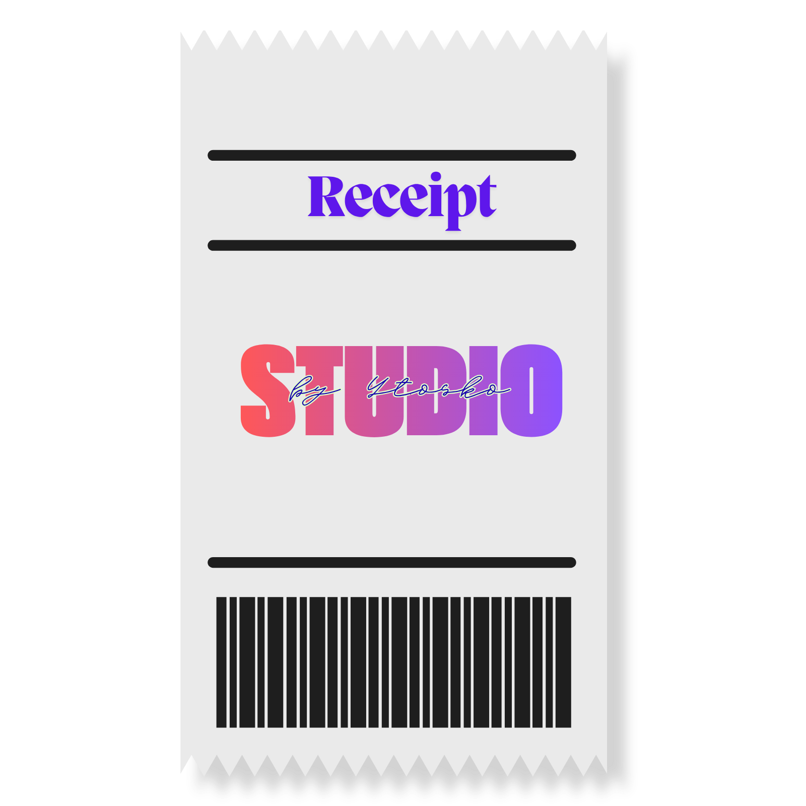

# Receipt Studio

<p align="center">
  
</p>

<p align="center">
  <a href="https://reciept-printer.ytosko.dev/"></a>
  <a href="https://github.com/Ytosko/Receipt-Studio/releases/latest"></a>
  <a href="LICENSE"></a>
  
</p>

<p align="center">
  <a href="https://github.com/Ytosko/Receipt-Studio/releases/latest"><strong>Download Receipt Studio</strong></a>
  ·
  <a href="https://reciept-printer.ytosko.dev/">Product website</a>
  ·
  <a href="CONTRIBUTING.md">Contribute</a>
</p>

Receipt Studio is a local-first Windows desktop point-of-sale and structured thermal-receipt designer. It manages shops, products, customers, sales, templates, and printers without an external database or cloud account. It supports Rongta-compatible ESC/POS output over raw TCP, installed Windows printers, receipt-width PDF export, backups, and diagnostics.

Completed sales receive collision-checked random receipt identifiers rather than reusable sequential numbers. Payment methods can be managed under **Settings → Payment methods**. QR blocks generate genuine scannable codes in the designer, PDF output, system printing, and ESC/POS printing; their payload can contain the receipt number, total, shop name, or a custom variable-based value.

An XML-formatted project and release reference is available in [`README.xml`](README.xml). The project is released under the MIT License.

Receipt Studio also supports fixed-size product-label design and printing. Label profiles can use Windows-installed USB printers or raw network ZPL/TSPL printers. Included media presets are 4×6, 4×4, 3×2, 2×1.5, and 2×1 inches plus common metric sizes. Width and height can always be entered manually for custom sheets. Label printers are intentionally separate from POS receipt printers.

## Product website

Explore the product, printer options, label designer, and latest Windows download at [reciept-printer.ytosko.dev](https://reciept-printer.ytosko.dev/).

## Requirements

- Windows 10 or 11, 64-bit
- Node.js 22 and npm for development
- For network printing, the computer and printer must normally be on the same local network
- For USB/system printing, install the printer's Windows driver so the device appears in Windows

## Development and builds

```powershell
npm install
npm run dev
npm run lint
npm run typecheck
npm run test
npm run test:e2e
npm run build
npm run dist
```

`npm run dist` creates an NSIS installer and portable executable under `release/`. Production renderer, Electron main-process, and preload files are generated under `dist/`.

### Publishing a GitHub release

1. Run every validation command above.
2. Update the version in `package.json`.
3. Run `npm run dist`.
4. Create a tag such as `v1.0.0` and push it to GitHub.
5. Create a GitHub Release for that tag.
6. Attach the Setup and Portable executables from `release/`.
7. Add release notes covering features, fixes, data compatibility, and known printer limitations.

For public distribution, Authenticode-sign the executables so Windows can identify the publisher and SmartScreen warnings are reduced.

## Local data, backup, and reset

Data is stored as readable, validated JSON under Electron's `userData/data` directory (normally `%APPDATA%\Receipt Studio\data`). Writes use a temporary file and atomic rename. Malformed files are copied to `backups` before a valid default replaces them. Automatic backups rotate to the latest ten.

Use **Settings → Export backup** to copy a complete backup folder. **Import backup** validates every collection before replacement and creates a safety backup. To reset safely, close the application, export or copy the entire user-data folder, then rename the original folder; do not delete it until the replacement starts correctly.

## Rongta RP336UV network setup

The first launch creates a profile for `192.168.68.68:9100`, 80 mm paper, 72 mm printable width, 48 characters per line, CP437, automatic cut, four feed lines, and a 5000 ms timeout. Edit all values on **Printers**.

Verify the printer's IP from its self-test/configuration page or router, then test Windows connectivity:

```powershell
Test-NetConnection 192.168.68.68 -Port 9100
```

If it fails, confirm both devices are on the same LAN, the address has not changed, port 9100/raw printing is enabled, client isolation is off, and Windows Firewall or endpoint security is not blocking outbound TCP. Avoid broad network scans; set the known address explicitly.

Use **Print test** on the printer profile, choose a saved receipt template, and print it with sample customer and sale data. The test uses the same rendering and printer-delivery path as a real sale but does not create a sale record. A successful raw TCP write means the computer delivered bytes to the socket; it does **not** prove paper physically printed. Paper, cover, firmware, queue state, encoding, and printer command compatibility still require real-hardware verification.

## USB / system printer mode

Install the manufacturer's Windows driver, add or edit a printer profile, and select **Windows / USB system printer**. Use **Refresh printers** to discover installed devices and select the exact printer from the dropdown. System mode uses Electron's Windows printing path. Missing or renamed devices are reported; raw USB VID/PID access is intentionally not required.

## Label printers and custom media

Create a printer profile with type **Label printer**, then choose either a Windows/USB system printer or a raw network connection. Network label profiles support ZPL and TSPL/TSPL2. Configure resolution, orientation, label gap, darkness, and media size.

Open **Label Templates** to create a fixed-size price-tag design. Product name, price, SKU, stock, barcode, and QR fields are filled automatically from the selected product; custom text, boxes, and dividers are also available. Elements can be dragged, resized, rotated, and positioned using exact millimeter values. Once a template exists, use **Print label** beside any product and choose both the label template and label printer. Printer tests use the same templates with sample product data. A custom sheet is created by entering any positive width and height in millimeters.

POS checkout lists receipt printers only. Label printers cannot be selected for sales or receipt-template tests.

Encoding presets for ESC/POS receipts include common CP437/CP850-family pages, Windows-1252, ISO-8859-1, GB18030, Big5, and Shift-JIS. Actual character availability still depends on printer firmware.

## Architecture

- `src/main`: Electron lifecycle, typed IPC, JSON repository, backup/diagnostics, PDF, ESC/POS and printer services
- `src/preload`: narrow context-isolated renderer API
- `src/renderer`: React/Tailwind UI, Zustand state, POS, history, management screens and dnd-kit designer
- `shared`: Zod schemas, defaults, integer-money utilities
- `tests`: Vitest unit coverage and Playwright Electron workflow

The canonical receipt line model powers preview-oriented rendering, HTML/PDF, system printing, and ESC/POS generation. Renderer code has no Node, filesystem, or socket access.

## Known limitations

- Actual print mechanics, raster logo fidelity, barcode/QR firmware compatibility, label calibration, and character encoding require verification on the physical printer.
- USB uses the Windows-installed printer path, not direct USB device access.
- Network socket success cannot confirm physical paper output.
- Receipt PDF height is derived from content and may vary slightly by Chromium version.
